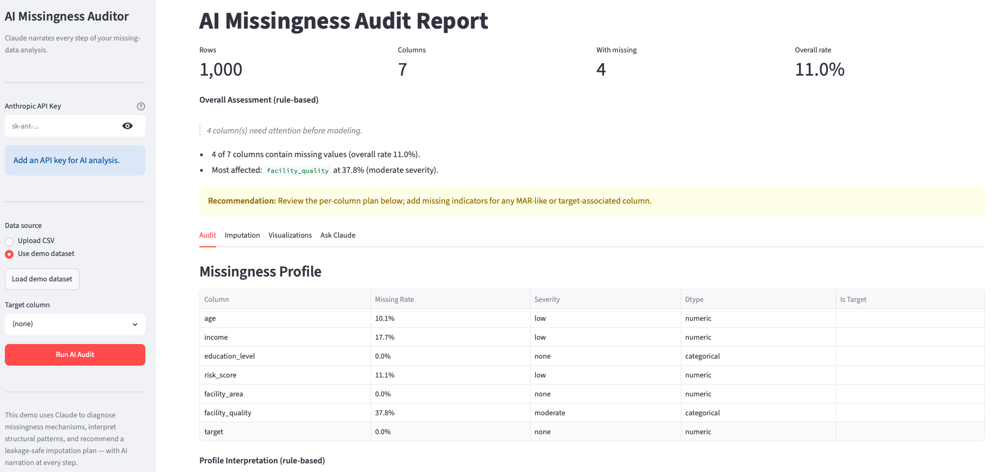
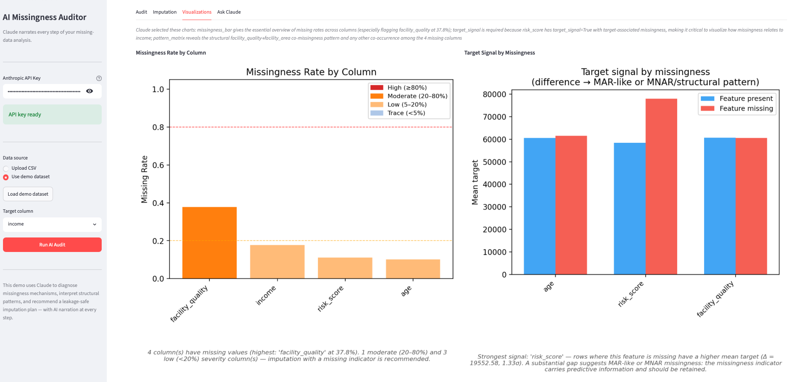

# [Award C] AI Missingness Auditor

> **Team info**
> | Legal name | Affiliation | Institutional email | Kaggle username |
> |---|---|---|---|
> | Yuqi Cheng | University of North Carolina at Chapel Hill | yuqi16614994@gmail.com | yuqic1661 |
> | Shucheng Liu | University of North Carolina at Chapel Hill | lsc210204@gmail.com | shuchengliu |
> | Akemi Hara | University of North Carolina at Chapel Hill | akehara1001@gmail.com | akehara |
> | Shan Gao | University of North Carolina at Chapel Hill | ssssgao777@gmail.com | GaoSShan |
>
> **Registered team name:** BIG-S2_A

**GitHub repository:** https://github.com/yuqicVicky/BIG_S2_A_awardC

---

## What it does

AI Missingness Auditor is a reusable statistical skill for diagnosing missing data before imputation. It profiles missingness, detects MCAR-compatible, MAR-like, group-dependent, target-associated, and structural absence clues, then produces a leakage-safe imputation plan that downstream data-science agents can apply. The live demo is a Claude-enhanced Streamlit app that explains the audit, shows diagnostic figures, and lets users accept or override recommended strategies.

## Demo link

Live demo: https://aimissingnessauditor.streamlit.app/

Kaggle discussion index: https://www.kaggle.com/competitions/stai-x-challenge-2026/discussion?sort=hotness



## Agent Design and Architecture

| Component | What it does |
|---|---|
| Reusable statistical skill | The Python package performs the core audit: profiling missingness, testing mechanism clues, detecting structural absence, planning leakage-safe imputation, and writing reproducible artifacts. |
| Streamlit control layer | The sidebar collects the API key, data source, target column, and **Run AI Audit** action so the same skill can be used with the demo data or an uploaded CSV. |
| Audit tab | Presents the AI Missingness Audit Report, rule-based assessment, missingness profile, mechanism evidence, and structural findings in one review surface. |
| Imputation tab | Shows AI recommendations and lets users either apply the recommended plan or override strategies column by column. |
| Visualizations tab | Uses Claude-assisted chart selection to show the most relevant diagnostic figures and captions for the current dataset. |
| Ask Claude tab | Provides a follow-up explanation interface grounded in the audit, imputation plan, and chart evidence. |
| Outputs | Delivers `imputation_plan.json`, `missing_data_report.md`, diagnostic figures, reproducibility artifacts, and optional imputed CSVs for downstream agents. |

## Why participants can adopt it

- **Diagnose before imputation:** the module makes the agent inspect missingness mechanisms before filling values.
- **Preserve missingness signal:** target-associated or MAR-like gaps receive missingness indicators instead of being silently smoothed away.
- **Detect structural absence:** the detector separates "the thing does not exist" from "the value was not collected."
- **Prevent leakage:** all medians, modes, group medians, and imputation parameters are fit on training data only.

## Example output

The bundled demo has 1,000 rows, 7 columns, 4 columns with missing values, and an 11.0% overall missing rate.

| Column | Missing rate | Mechanism clue | Recommended strategy |
|---|---:|---|---|
| `age` | 10.1% | MCAR-compatible | `numeric_median_plus_indicator` |
| `income` | 17.7% | Group-dependent missingness by `education_level` | `groupwise_numeric_median_plus_indicator` |
| `risk_score` | 11.1% | Target-associated missingness | `numeric_median_plus_indicator` |
| `facility_quality` | 37.8% | Structural absence concern with `facility_area` | `structural_none_token_plus_indicator` |



## Outputs

- `imputation_plan.json`: machine-readable plan for downstream agents.
- `missing_data_report.md`: human-readable audit report with evidence and limitations.
- Diagnostic figures: missingness bar chart, pattern matrix, and target-signal chart.
- Imputed CSV outputs: optional train/predict data after applying the selected plan.

## Reuse in another agent

```python
import pandas as pd
from missingness_auditor import MissingnessAuditor

df = pd.read_csv("my_data.csv")
auditor = MissingnessAuditor(df, target_col="target")
results = auditor.run()

plan = results["imputation_plan"]
imputed_df = auditor.apply_imputation(df, plan)
```

This makes the missingness audit a drop-in pre-imputation step for a larger statistical agent, data-cleaning assistant, or modeling pipeline.
