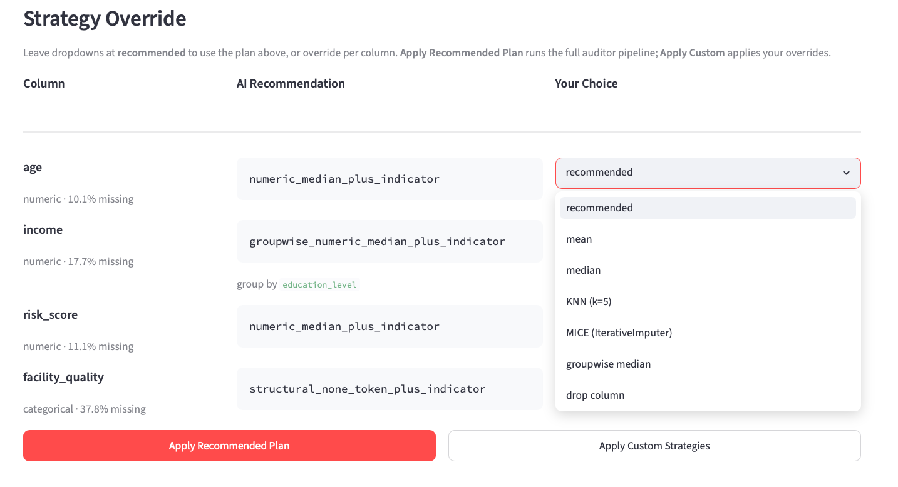
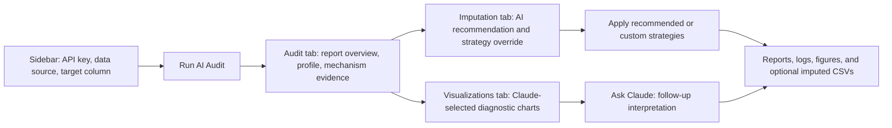

<h1>
  <sub></sub>
  AI Missingness Auditor
</h1>

> **Award C Statistical Skill / Agent Module**  
> A Claude-enhanced Streamlit demo for diagnosing missing data before imputation.

[](#award-c-submission-info)
[](pyproject.toml)
[](https://aimissingnessauditor.streamlit.app/)
[](#agent-design-and-architecture)
[](#statistical-notes)

**Live demo:** [aimissingnessauditor.streamlit.app](https://aimissingnessauditor.streamlit.app/)  
**Kaggle discussion:** [STAI-X Challenge 2026 discussions](https://www.kaggle.com/competitions/stai-x-challenge-2026/discussion?sort=hotness)  
**GitHub repository:** [https://github.com/yuqicVicky/BIG_S2_A_awardC](https://github.com/yuqicVicky/BIG_S2_A_awardC)

**Quick links:** [Why this exists](#why-this-exists) · [Demo walkthrough](#demo-walkthrough) · [Architecture](#agent-design-and-architecture) · [Use it](#use-it) · [Award C draft](AWARD_C_POST.md)


| Output | Description |
|--------|-------------|
| **Missingness profile** | Per-column missing rates, severity labels (trace/low/moderate/high), dtype category |
| **Mechanism clues** | MCAR-compatible / MAR-like / MNAR/structural concern — statistical clues, not causal claims |
| **Structural missingness** | Detects `(categorical NA → numeric companion is 0)` patterns — absence of a thing, not data error |
| **Imputation plan** | Column-specific strategy (decision ladder in `references/missingness_decision_rules.md`), with a leakage-safe fit scope |
| **Leakage-safe protocol** | Confirms all statistics are fit on train only, never on predict |
| **Mechanism tests** | Little's MCAR test (global) + per-column logistic-LR / χ² / point-biserial significance |
| **Diagnostic figures** | Missingness bar chart, pattern matrix, target signal, decision flow, MNAR tipping point |
| **Markdown report** | Human-readable narrative summary of all findings |

AI Missingness Auditor is a reusable statistical skill for autonomous data-science agents and interactive analysts. Given a CSV or pandas DataFrame, it profiles missingness, surfaces mechanism clues, detects structural absence patterns, and writes a leakage-safe imputation plan before any values are filled.

## Why This Exists

Missing values are often treated as a mechanical cleanup step: run a median imputer, add a model, move on. That is risky for agentic analysis because the missing value can be the statistical signal.

This skill forces the agent to diagnose first:

| Risk | What can go wrong | How the auditor responds |
|---|---|---|
| Structural missingness | `facility_quality` is `NaN` because no facility exists, not because a value was lost. | Detects categorical-NA plus numeric-zero companion patterns and recommends structural tokens or zero fills with indicators. |
| Target-associated missingness | A feature is missing more often in high-risk or high-outcome rows. | Preserves the missingness signal with indicator columns and evidence in the plan. |
| Train/test leakage | Median, mode, group median, or model imputation parameters are fit on the full dataset. | Records `fit_on: train_only` and applies fitted statistics to prediction data without refitting. |

## What It Does

| Component | Output | Why it matters |
|---|---|---|
| Missingness profile | Per-column missing rate, severity, dtype, cardinality, target flag | Establishes the size and location of the problem. |
| Mechanism audit | MCAR-compatible, MAR-like, group-dependent, target-associated, or insufficient-evidence clues | Gives the agent a statistical reason for each imputation choice. |
| Structural detector | Pairs such as categorical NA with numeric zero/absence | Separates "the thing does not exist" from "the value was not collected." |
| Imputation planner | Column-level strategy, indicator flag, reason, fit scope | Produces a machine-readable action plan for downstream agents. |
| Leakage check | Protocol and warnings for train/predict usage | Keeps preprocessing statistics out of held-out or prediction rows. |
| Visual diagnostics | Missingness bar chart, pattern matrix, target signal chart | Makes the evidence inspectable by humans. |
| Report writer | Markdown report plus JSON logs | Leaves a reproducible audit trail. |

## Demo Walkthrough

The bundled demo contains **1,000 rows**, **7 columns**, **4 columns with missing values**, and an **11.0% overall missing rate**. It is designed to exercise four different missingness patterns in one small dataset.


| Column | Missing rate | Mechanism clue | Recommended strategy |
|---|---:|---|---|
| `age` | 10.1% | MCAR-compatible | `numeric_median_plus_indicator` |
| `income` | 17.7% | Group-dependent missingness by `education_level` | `groupwise_numeric_median_plus_indicator` |
| `risk_score` | 11.1% | Target-associated missingness | `numeric_median_plus_indicator` |
| `facility_quality` | 37.8% | Structural absence concern with `facility_area` | `structural_none_token_plus_indicator` |

The visual diagnostics show both the scale of missingness and whether missingness itself is associated with the selected target. In the demo, `risk_score` missingness carries strong target signal, so the plan keeps a missing indicator instead of silently smoothing it away.

## Imputation Plan

The plan is explicit enough for a downstream modeling agent to apply without rerunning the full audit. Users can accept the recommended plan or override individual strategies inside the Streamlit interface.



| Strategy | When it is used |
|---|---|
| `no_imputation_needed` | Column is fully observed or is the target column. |
| `numeric_median` | Numeric column with low-risk missingness where an indicator is not needed. |
| `numeric_median_plus_indicator` | Numeric column with moderate missingness, MAR-like evidence, or target-associated missingness. |
| `groupwise_numeric_median_plus_indicator` | Numeric column whose missingness is concentrated in categorical groups. |
| `categorical_missing_token` | Categorical column where an explicit missing token is preferable to mode fill. |
| `categorical_missing_token_plus_indicator` | Categorical column where missingness itself should be preserved as a feature. |
| `structural_none_token_plus_indicator` | Categorical structural absence, such as "no facility" encoded as `NaN`. |
| `structural_zero_plus_indicator` | Numeric structural absence where zero is supported by companion-column evidence. |
| `drop_column` | Extremely sparse columns where the missingness rate is too high for a stable feature. |

## Agent Design and Architecture

| Component | What it does |
|---|---|
| Sidebar inputs | The Streamlit shell collects the Anthropic API key, data source, optional upload/demo dataset, target column, and the **Run AI Audit** trigger. |
| Audit tab | Shows the report headline, dataset counts, rule-based overall assessment, missingness profile table, mechanism tests, and structural absence findings. |
| Imputation tab | Presents AI recommendations, decision cards, leakage-safe strategy details, and the strategy override workflow with **Apply Recommended Plan** or **Apply Custom Strategies**. |
| Visualizations tab | Displays Claude-selected diagnostic charts with captions, including missingness rates and target signal by missingness when a target is available. |
| Ask Claude tab | Lets users ask follow-up questions grounded in the current audit, plan, and chart evidence. |
| Reusable skill layer | The same profiler, mechanism audit, structural detector, planner, imputer, visualizer, and report writer remain available through the Python API and CLI. |
| Outputs | The workflow produces a human-readable report plus machine-readable logs, `imputation_plan.json`, diagnostic figures, reproducibility artifacts, and optional imputed CSVs. |



## Use It

### Streamlit demo

```bash
pip install -r requirements.txt
pip install -e .
streamlit run app.py
```

Then open `http://localhost:8501`, load the demo dataset or upload a CSV, select a target column if available, and run the audit.

### CLI

```bash
python -m missingness_auditor.cli \
  --data examples/demo_missingness.csv \
  --target target \
  --out outputs/demo_missingness/ \
  --json-summary
```

For a train/predict split:

```bash
python -m missingness_auditor.cli \
  --train train.csv \
  --predict predict.csv \
  --target target \
  --out outputs/missingness_audit/
```

### Python API

```python
import pandas as pd
from missingness_auditor import MissingnessAuditor

auditor = MissingnessAuditor(df, predict_df=predict_df, target_col="target")
results = auditor.run()               # pure computation, no disk writes
auditor.save_outputs(results, "outputs/")  # writes logs, figures, reports + reproduction artifacts

auditor = MissingnessAuditor(df, target_col="target")
results = auditor.run()
auditor.save_outputs(results, "outputs/demo_missingness")

imputed_df = auditor.apply_imputation(df, results["imputation_plan"])
```

## Repository Map

```text
.
  app.py                         Streamlit demo
  src/missingness_auditor/       Reusable Python skill
  examples/                      Demo data builders and runnable examples
  references/                    Missing-data references and decision rules
  figures/                       README and Kaggle submission screenshots
  AWARD_C_POST.md                Kaggle Discussion draft
  EVALUATION.md                  Award C evaluation notes
```

## Quality Checks

```bash
PYTHONPATH=src python -m missingness_auditor.cli \
  --data examples/demo_missingness.csv \
  --target target \
  --out /tmp/missingness-auditor-smoke/ \
  --json-summary
```

## Outputs

Each saved audit produces JSON logs, figures, and a Markdown report.

```text
outputs/
  logs/
    missingness_profile.json
    missingness_mechanism_audit.json
    structural_missingness_audit.json
    imputation_plan.json
    leakage_safe_imputation_check.json
    mice_pooling.json                 MICE + Rubin's-rules pooling (inference)
    mnar_sensitivity.json             MNAR delta-adjustment tipping points
  figures/
    missingness_bar.png
    pattern_matrix.png
    target_signal.png
    missing_correlation.png
    decision_flow.png                 CONSORT-style imputation decision flow
    mnar_tipping_point.png            Delta-adjustment sensitivity trajectories
  reports/
    missing_data_report.md
    missing_data_report.pdf           Methods-appendix PDF
  reproduce_imputation.py             Standalone, self-verifying reproduction script
  source_data.csv                     Frozen copy of the input for the reproduction script
  train_imputed.csv                   Imputed training data (after apply_imputation)
  predict_imputed.csv                 Imputed predict data (if a predict set was provided)
```

Compact `imputation_plan.json` example:

```json
{
  "columns": {
    "income": {
      "strategy": "groupwise_numeric_median_plus_indicator",
      "add_missing_indicator": true,
      "reason": "group_dependent_missingness_by_feature='education_level'",
      "fit_on": "train_only",
      "mechanism_label": "group-dependent missingness",
      "group_col": "education_level"
    },
    "risk_score": {
      "strategy": "numeric_median_plus_indicator",
      "add_missing_indicator": true,
      "reason": "mechanism='target-associated missingness'_or_moderate_missing_rate",
      "fit_on": "train_only",
      "mechanism_label": "target-associated missingness"
    },
    "facility_quality": {
      "strategy": "structural_none_token_plus_indicator",
      "add_missing_indicator": true,
      "reason": "structural_absence_categorical_na_encodes_absence",
      "fit_on": "train_only",
      "mechanism_label": "structural absence concern"
    }
  },
  "summary": {
    "n_columns_to_impute": 4,
    "columns_needing_missing_indicator": [
      "age",
      "income",
      "risk_score",
      "facility_quality"
    ]
  }
}
```

## Statistical Notes

- Mechanism labels are **observational clues**, not causal proof. MCAR, MAR, and MNAR cannot be confirmed from a single observed dataset alone.
- Missingness associated with observed features or the target should usually be preserved with a missingness indicator.
- All imputation statistics must be fit on training data only. Prediction or test rows should receive the fitted statistic, never influence it.
- Single imputation is practical for ML feature engineering, but it underestimates uncertainty for formal statistical inference. For confidence intervals, hypothesis tests, or publication-grade inference, consider full multiple imputation such as MICE with Rubin's rules.
- Structural absence detection is evidence-based but still heuristic. Domain knowledge should override the plan when the semantics of a column are known.

## Award C Submission Info

> **Team info**
> | Legal name | Affiliation | Institutional email | Kaggle username |
> |---|---|---|---|
> | Yuqi Cheng | University of North Carolina at Chapel Hill | yuqi16614994@gmail.com | yuqic1661 |
> | Shucheng Liu | University of North Carolina at Chapel Hill | lsc210204@gmail.com | shuchengliu |
> | Akemi Hara | University of North Carolina at Chapel Hill | akehara1001@gmail.com | akehara |
> | Shan Gao | University of North Carolina at Chapel Hill | ssssgao777@gmail.com | GaoSShan |
>
> **Registered team name:** BIG-S2_A

**GitHub repository:** [https://github.com/yuqicVicky/BIG_S2_A_awardC](https://github.com/yuqicVicky/BIG_S2_A_awardC)  
**Demo link:** [https://aimissingnessauditor.streamlit.app/](https://aimissingnessauditor.streamlit.app/)  
**Kaggle discussion:** [STAI-X Challenge 2026 discussions](https://www.kaggle.com/competitions/stai-x-challenge-2026/discussion?sort=hotness)

This repository contributes a reusable statistical skill for Award C: a pre-imputation missingness auditor that other participants can adopt in their own data-cleaning agents, validation pipelines, or Streamlit demos.
